# Assignment 2 - DIP with PyTorch

### In this assignment, you will implement traditional DIP (Poisson Image Editing) and deep learning-based DIP (Pix2Pix) with PyTorch.

### Resources:
- [Assignment Slides](https://rec.ustc.edu.cn/share/705bfa50-6e53-11ef-b955-bb76c0fede49)  
- [Paper: Poisson Image Editing](https://www.cs.jhu.edu/~misha/Fall07/Papers/Perez03.pdf)
- [Paper: Image-to-Image Translation with Conditional Adversarial Nets](https://phillipi.github.io/pix2pix/)
- [Paper: Fully Convolutional Networks for Semantic Segmentation](https://arxiv.org/abs/1411.4038)
- [PyTorch Installation & Docs](https://pytorch.org/)

---

### 1. Implement Poisson Image Editing with PyTorch.
Fill the [Polygon to Mask function](run_blending_gradio.py#L95) and the [Laplacian Distance Computation](run_blending_gradio.py#L115) of 'run_blending_gradio.py'.


### 2. Pix2Pix implementation.
See [Pix2Pix subfolder](Pix2Pix/).

---
### 实验结果

#### 1. Implement Poisson Image Editing with PyTorch.
原始图片为：
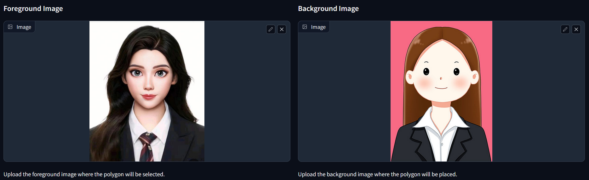

选定区域为：
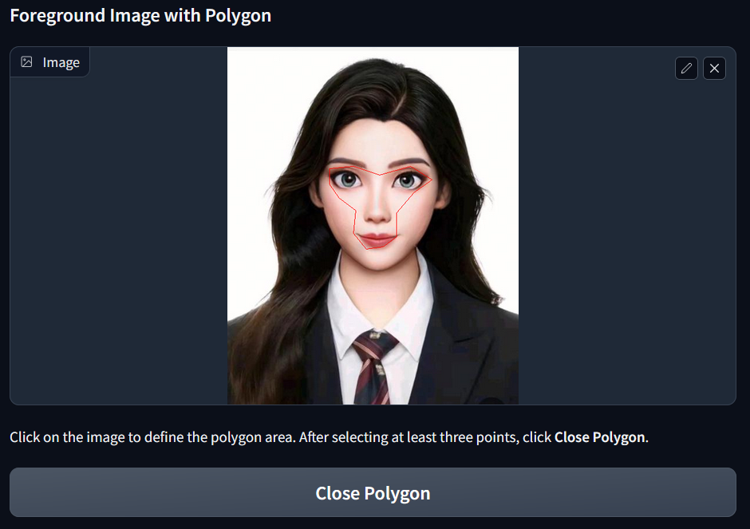

最终得到的效果为：
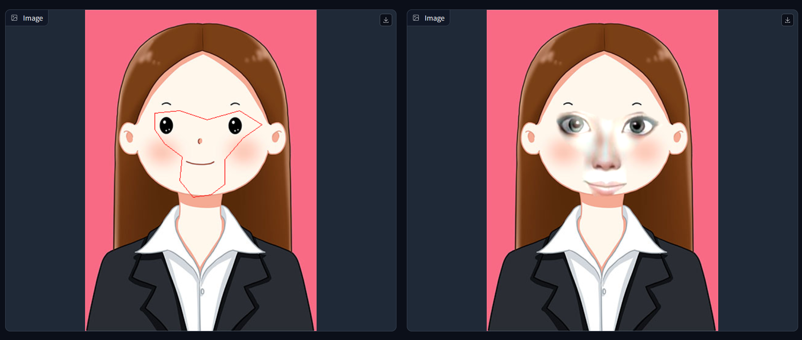

程序最终误差为：
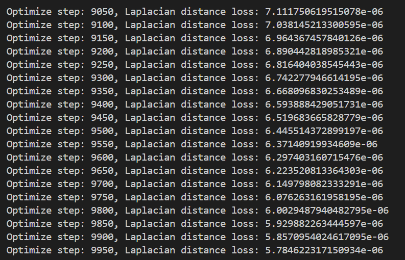

#### 2. Pix2Pix implementation.
若要训练Facades Dataset，则需运行
```bash
bash download_facades_dataset.sh
python train.py
```

若要训练CityScapes Dataset，则需将'./Pix2Pix/cityscapes_train_list.txt'改名为'train_list.txt'，'./Pix2Pix/cityscapes_val_list.txt'改名为'val_list.txt'，并运行
```bash
bash ./datasets/download_dataset.sh cityscapes
python train.py
```

在Facades Dataset上部分对于train的运行结果：
epoch=0时
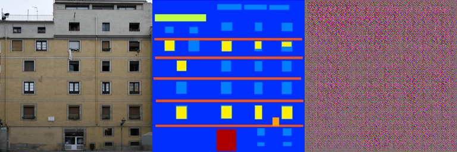
epoch=200时
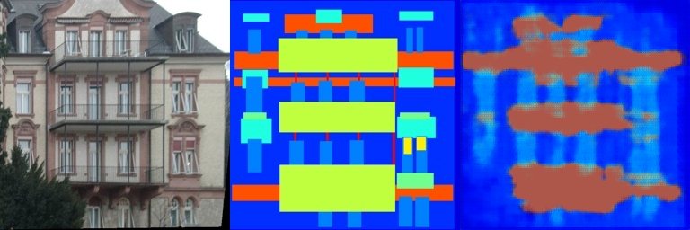
epoch=700时
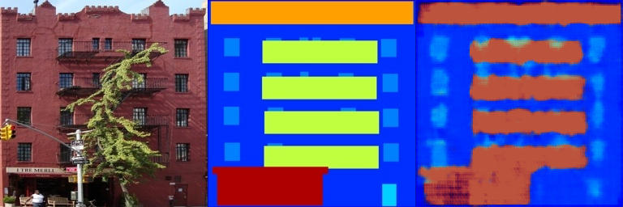
对于val的运行结果为：
epoch=0时
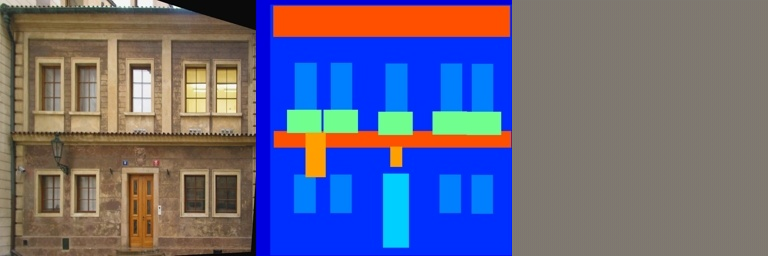
epoch=200时
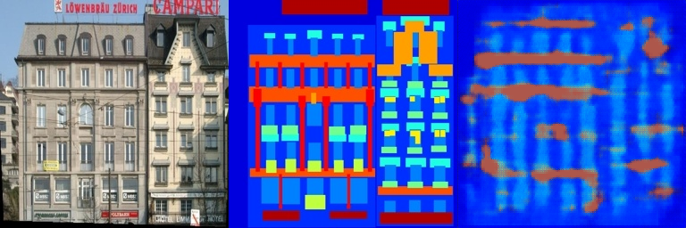
epoch=700时
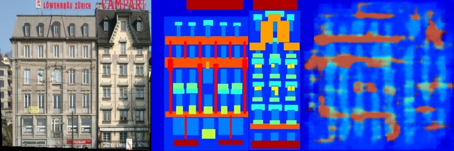

在CityScapes Dataset上部分对于train的运行结果：
epoch=0时
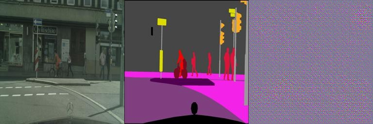
epoch=200时
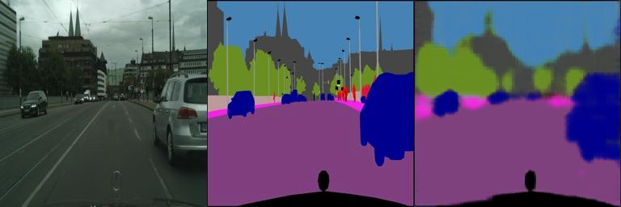
epoch=700时
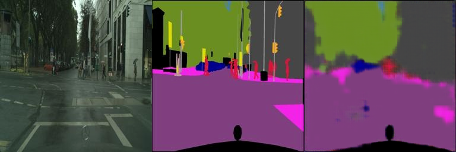
对于val的运行结果为：
epoch=0时
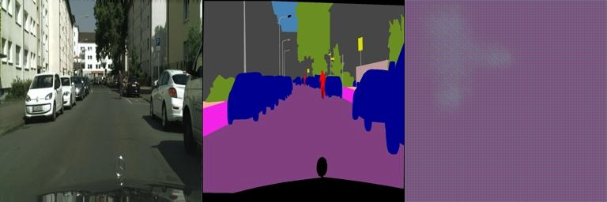
epoch=200时
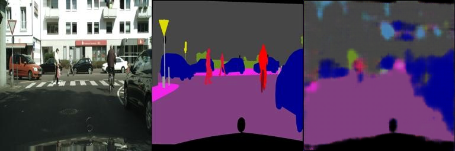
epoch=700时
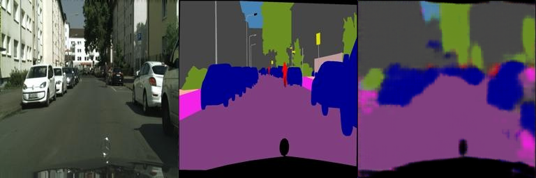


