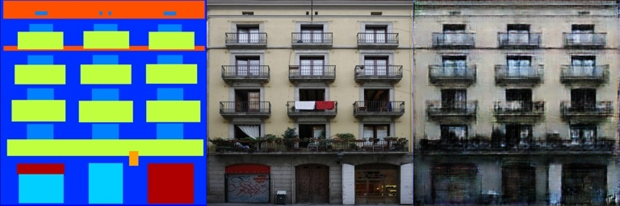
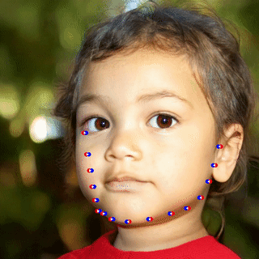

# Assignment 3 - Play with GANs

### In this assignment, you will implement two methods for using GANs in digital image processing.

### Resources:
- [DragGAN](https://vcai.mpi-inf.mpg.de/projects/DragGAN/): [Implementaion 1](https://github.com/XingangPan/DragGAN) & [Implementaion 2](https://github.com/OpenGVLab/DragGAN)
- [Facial Landmarks Detection](https://github.com/1adrianb/face-alignment)

---

## 1. Increment hw2 with Discriminative Loss.
### 算法设计
#### 网络结构
利用cGAN结构，实现将边缘图转化为对应的照片，由Generator和Discriminator网络组成。
     
     Generator网络使用 U-Net 架构，由编码器和解码器组成，编码器提取特征，解码器负责生成图片，且可以加入跳跃连接以保留低层次特征。
     
     Discriminator网络使用了 PatchGAN 架构，通过判别图像的局部 patch 是否是real或fake。

#### 训练流程
交替更新Generator 和 Discriminator。

     1.更新 Discriminator：固定 Generator，更新 Discriminator，使其能够区分真实图像和生成图像。

     2.更新 Generator：固定 Discriminator，更新 Generator，使其生成的图像更难被 Discriminator 区分。

#### 损失函数
条件GAN的总损失由两部分组成：

以及L1（Lrecon）损失。

总损失为两者的加权和：LG=LcGAN+λ*Lrecon

其中 λ 是重建损失的权重超参数，在实验中取100。

### 模型训练及验证
在Increment_hw2中运行
```bash
python train.py
```
### 实验结果
在Facades Dataset上部分对于train的运行结果：
epoch=0时

epoch=200时


对于val的运行结果为：
epoch=0时

epoch=200时


## 2. Combine DragGAN with Automatic Face Landmarks.

配置DragGAN的各个包的版本为

      draggan              1.1.6
      face-alignment       1.4.1
      gradio               3.34.0
      pydantic             1.10.19
      torch                1.13.1
      torchaudio           0.13.1
      torchvision          0.14.1

单独测试DragGAN的结果为


将DragGAN和face-alignment合并后，运行程序则在Combine_DragGAN中输入以下命令
```bash
python DragGANwithAFL.py
```

打开界面时会对图片进行自动描点，如下图


可操作台为


选择“Smile”，则会自动选点使人物微笑，得到效果如下图


选择“Close eyes”，则会自动选点使人物闭眼，得到效果如下图


选择“Thinning face”，则会自动选点使人瘦脸，得到效果如下图

