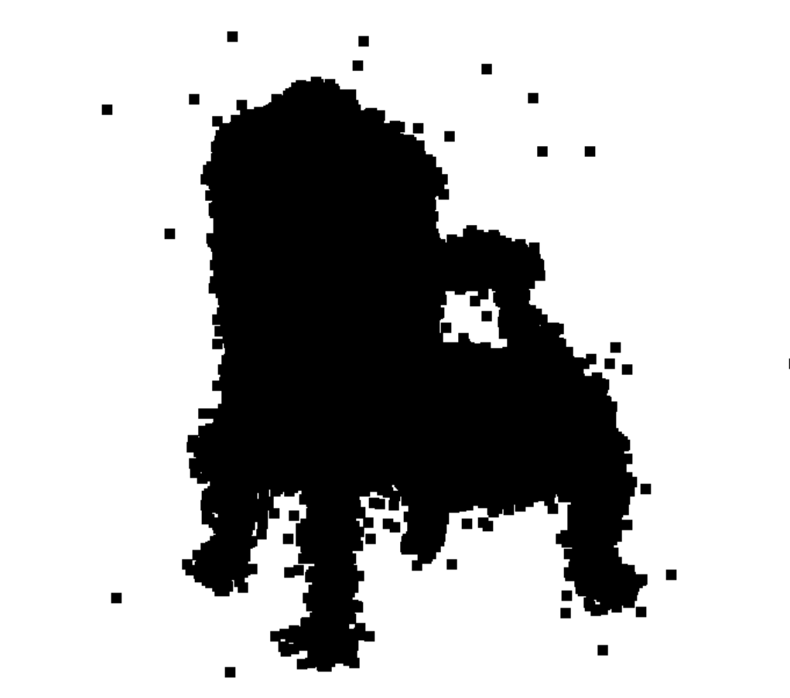
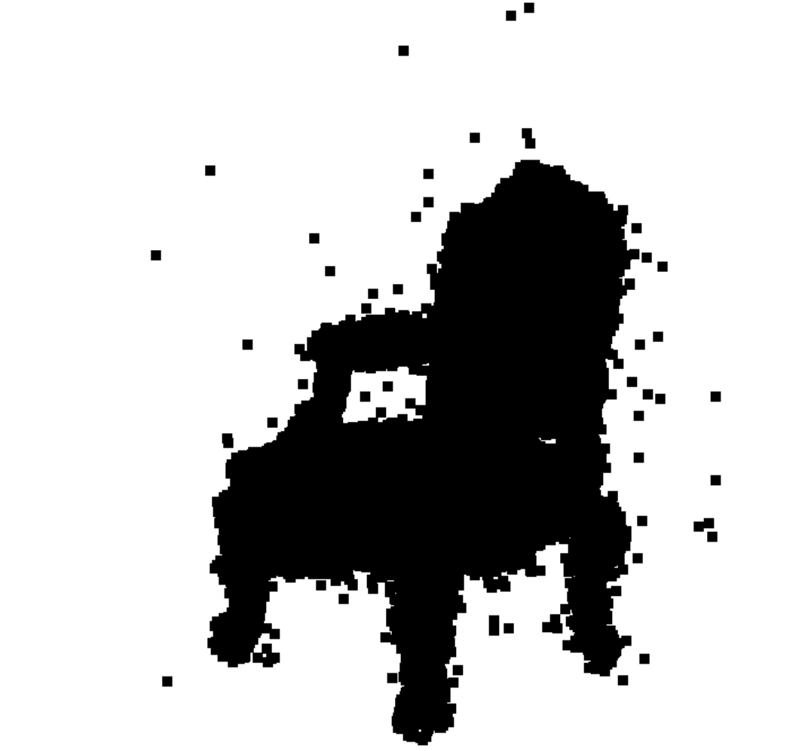
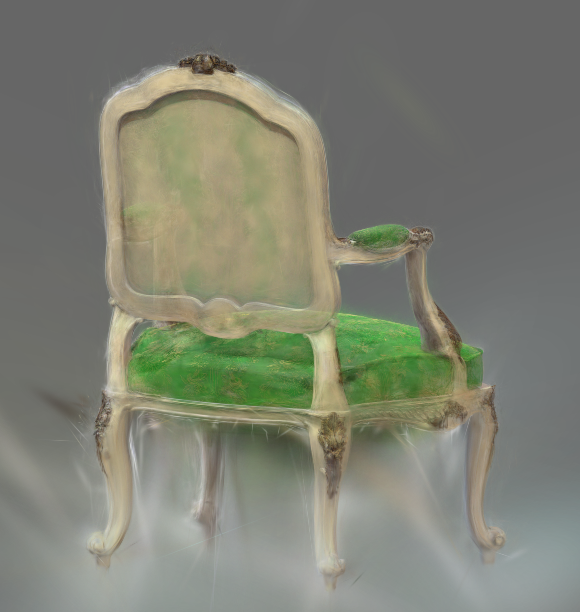
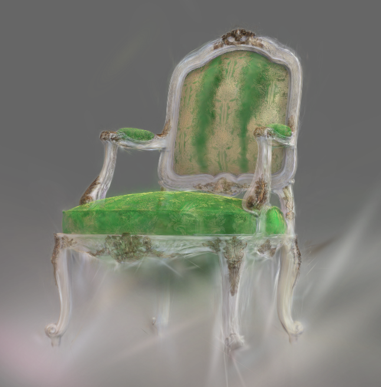
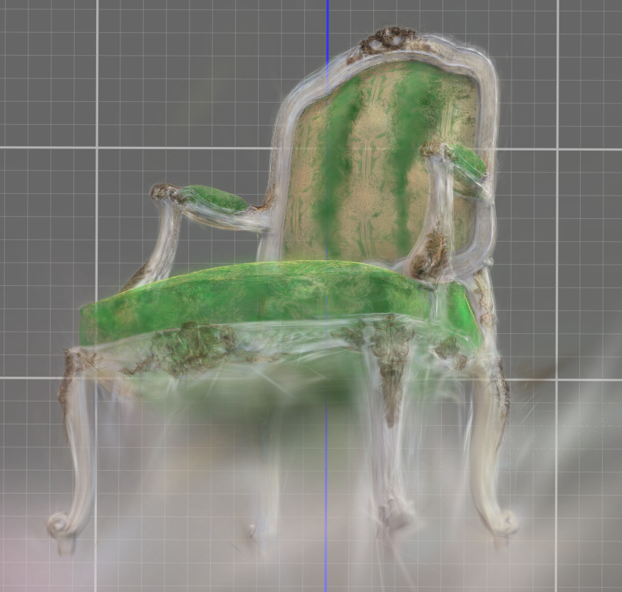

# Assignment 4 - Implement Simplified 3D Gaussian Splatting

This assignment covers a complete pipeline for reconstructing a 3D scene represented by 3DGS from multi-view images. The following steps use the [chair folder](data/chair); you can use any other folder by placing images/ in it.

### Resources:
- [Paper: 3D Gaussian Splatting](https://repo-sam.inria.fr/fungraph/3d-gaussian-splatting/)
- [3DGS Official Implementation](https://github.com/graphdeco-inria/gaussian-splatting)
- [Colmap for Structure-from-Motion](https://colmap.github.io/index.html)

---

### Step 1. Structure-from-Motion
First, we use Colmap to recover camera poses and a set of 3D points. Please refer to [11-3D_from_Multiview.pptx](https://rec.ustc.edu.cn/share/705bfa50-6e53-11ef-b955-bb76c0fede49) to review the technical details.
```
python mvs_with_colmap.py --data_dir data/chair
```

Debug the reconstruction by running:
```
python debug_mvs_by_projecting_pts.py --data_dir data/chair
```

### Step 2. A Simplified 3D Gaussian Splatting (Your Main Part)
From the debug output of Step 1, you can see that the 3D points are sparse for rendering the whole image. We will expand each point to a 3D Gaussian to make it cover more 3D space.

#### 2.1 3D Gaussians Initialization
Refer to the [original paper](https://repo-sam.inria.fr/fungraph/3d-gaussian-splatting/3d_gaussian_splatting_low.pdf). For converting 3D points to 3D Gaussians, we need to define the covariance matrix for each point; the initial Gaussians' centers are just the points. According to equation (6), for defining covariance, we define a scaling matrix S and a rotation matrix R. Since we need to use the 3D Gaussians for volume rendering, we also need the opacity attribute and the color attribute for each Gaussian. The volume rendering process is formulated with equations (1), (2), (3). [The code here](gaussian_model.py#L32) contains functions to initialize these attributes as optimizable parameters. You need to fill [the code here](gaussian_model.py#L103) for computing the 3D Covariance matrix from the quaternion (for rotation) and the scaling parameters.

#### 2.2 Project 3D Gaussians to Obtain 2D Gaussians
According to equation (5), we need to project the 3D Gaussians to the image space by transforming with the world to camera transformation *_W_* and the Jacobian matrix *_J_* of the projection transformation. You need to fill [the code here](gaussian_renderer.py#L26) for computing the projection.

#### 2.3 Compute the Gaussian Values
World space to camera space
$$
F(3D) = 2D
$$
Reconstruction
$$
F^{-1}(2D) = 3D
$$
which means
$$
\left[
\begin{array}{c}
  X_c\\
  Y_c\\
  Z_c
\end{array}
\right]
=R·\left[
\begin{array}{c}
  X\\
  Y\\
  Z
\end{array}
\right]+T
$$
so the points $\{(u_1,v_1),(u_2,v_2),(u_3,v_3)\}$ on Image Plane could be written as
$$
\begin{array}{c}
  u=f·\frac{X_c}{Z_c}+c_x\\
  v=f·\frac{Y_c}{Z_c}+c_y
\end{array}
$$
so
$$
\begin{array}{c}
  u=f·\frac{R_{11}X+R_{12}Y+R_{13}Z+T_1}{R_{31}X+R_{32}Y+R_{33}Z+T_3}+c_x\\
  v=f·\frac{R_{21}X+R_{22}Y+R_{23}Z+T_2}{R_{31}X+R_{32}Y+R_{33}Z+T_3}+c_y
\end{array}
$$
which could be written as
$$
\left[
\begin{array}{c}
  u\\
  v\\
  1
\end{array}
\right]
=K\left[
  \begin{array}{cc}
    R&T
  \end{array}
\right]
\left[
\begin{array}{c}
  X\\
  Y\\
  Z\\
  1
\end{array}
\right]
\ \ \ \ K=\left[
\begin{array}{ccc}
  f&0&c_x\\
  0&f&c_y\\
  0&0&1
\end{array}
\right]
$$

so the 3D covariance matrix could be presented as
$$
\boldsymbol{\Sigma}_{3D} = RSS^TR^T
$$
and the Jacobian matrix of projection transformation is 
$$
\left[
\begin{array}{ccc}
  \frac{f_x}{z}&0&-\frac{f_xx}{z^2}\\
  0&\frac{f_y}{z}&-\frac{f_yy}{z^2}\\
\end{array}
\right]
$$
so the 2D covariance matrix could be presented as
$$
\boldsymbol{\Sigma}_{2D} = JW\boldsymbol{\Sigma}_{3D} W^TJ^T
$$
We need to compute 2D Gaussians for volume rendering. A 2D Gaussian is represented by:

$$
  f(\mathbf{x}; \boldsymbol{\mu}_{i}, \boldsymbol{\Sigma}_{i}) = \frac{1}{2 \pi \sqrt{ | \boldsymbol{\Sigma}_{i} |}} \exp \left ( {-\frac{1}{2}} (\mathbf{x} - \boldsymbol{\mu}_{i})^T \boldsymbol{\Sigma}_{i}^{-1} (\mathbf{x} - \boldsymbol{\mu}_{i}) \right ) = \frac{1}{2 \pi \sqrt{ | \boldsymbol{\Sigma}_{i} |}} \exp \left ( P_{(\mathbf{x}, i)} \right )
$$

Here, $\mathbf{x}$ is a 2D vector representing the pixel location, $\boldsymbol{\mu}$ represents a 2D vector representing the mean of the $i$-th 2D Gaussian, and $\boldsymbol{\Sigma}$ represents the covariance of the 2D Gaussian. The exponent part $P_{(\mathbf{x}, i)}$ is:

$$
  P_{(\mathbf{x}, i)} = {-\frac{1}{2}} (\mathbf{x} - \boldsymbol{\mu}\_{i})^T \mathbf{\Sigma}\_{i}^{-1} (\mathbf{x} - \boldsymbol{\mu}\_{i})
$$

You need to fill [the code here](gaussian_renderer.py#L61) for computing the Gaussian values.

#### 2.4 Volume Rendering (α-blending)
According to equations (1-3), using these `N` ordered 2D Gaussians, we can compute their alpha and transmittance values at each pixel location in an image.

The alpha value of a 2D Gaussian $i$ at a single pixel location $\mathbf{x}$ can be calculated using:


$$
  \alpha_{(\mathbf{x}, i)} = o_i*f(\mathbf{x}; \boldsymbol{\mu}\_{i}, \boldsymbol{\Sigma}\_{i})
$$


Here, $o_i$ is the opacity of each Gaussian, which is a learnable parameter.

Given `N` ordered 2D Gaussians, the transmittance value of a 2D Gaussian $i$ at a single pixel location $\mathbf{x}$ can be calculated using:

$$
  T_{(\mathbf{x}, i)} = \prod_{j \lt i} (1 - \alpha_{(\mathbf{x}, j)})
$$

The final result of the pixel is
$$
C=\sum\limits_{i=1}^NT_i\alpha_ic_i
$$

Fill [the code here](gaussian_renderer.py#L83) for final rendering computation.

After implementation, build your 3DGS model:
```
python train.py --colmap_dir data/chair --checkpoint_dir data/chair/checkpoints
```

### Compare with the original 3DGS Implementation
Since we use a pure PyTorch implementation, the training speed and GPU memory usage are far from satisfactory. Also, we do not implement some crucial parts like adaptive Gaussian densification scheme. Run the [original 3DGS implementation](https://github.com/graphdeco-inria/gaussian-splatting) with the same dataset to compare the results.

The result of epoch 0 


The result of epoch 80 


The result of epoch 150 


The result of epoch 195 


results of The original 3DGS



  

比较可知，在细节上的展现，原论文的结果明显优于我们的程序，但是我们的程序也能简单的构造形状。
